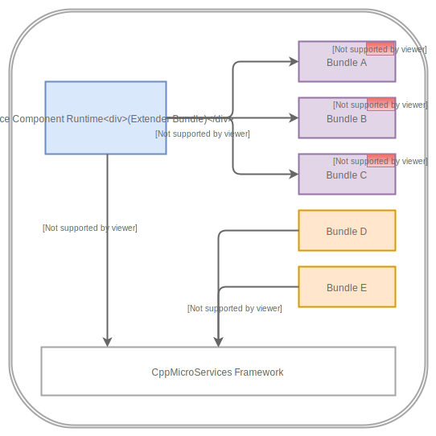
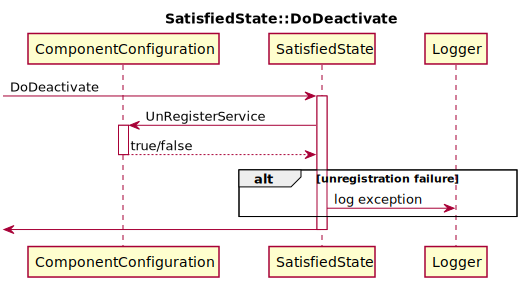

# Declarative Services Design Document
  - Authors: Abhinay Reddyreddy  

Table of Contents
=================

   * [Declarative Services Design Document](#declarative-services-design-document)
      * [Summary](#summary)
         * [Motivation](#motivation)
         * [Functional Design Summary](#functional-design-summary)
      * [Requirements Analysis](#requirements-analysis)
         * [User Roles and Goals](#user-roles-and-goals)
         * [Use Cases](#use-cases)
            * [UC1: Publish a service](#uc1-publish-a-service)
            * [UC2: Create services with dependencies](#uc2-create-services-with-dependencies)
            * [UC3: Get service dependency information](#uc3-get-service-dependency-information)
            * [UC4: Build Tool access into dependency information](#uc4-build-tool-access-into-dependency-information)
            * [UC5: Service Provider Framework](#uc5-service-provider-framework)
         * [Pain Point Summary](#pain-point-summary)
         * [Requirements](#requirements)
      * [Functional Design](#functional-design)
         * [Overview](#overview)
         * [Main Functional Design Description](#main-functional-design-description)
         * [Service Component Description JSON specification](#service-component-description-json-specification)
            * [Schema and Example](#schema-and-example)
         * [ Service Component Lifecycle API ](#-service-component-lifecycle-api-)
            * [Component Instance Methods](#component-instance-methods)
               * [Activate and Deactivate Methods](#activate-and-deactivate-methods)
            * [ Component Context ](#-component-context-)
         * [Dependency Injection](#dependency-injection)
            * [ Constructor Injection ](#-constructor-injection-)
            * [ Bind &amp; Unbind Callbacks ](#-bind--unbind-callbacks-)
            * [ Error Conditions ](#-error-conditions-)
         * [Introspection API](#introspection-api)
            * [ServiceComponentRuntime Interface](#servicecomponentruntime-interface)
            * [Data Transfer Object (DTO) Classes](#data-transfer-object-dto-classes)
         * [Code Generation Tool](#code-generation-tool)
            * [extern C functions](#extern-c-functions)
            * [ComponentInstance Interface](#componentinstance-interface)
         * [Design Cases](#design-cases)
            * [DC1 : Service provider bundle ](#dc1--service-provider-bundle-)
            * [DC2 : Service Dependencies ](#dc2--service-dependencies-)
            * [DC3 : Declarative Services Runtime Inspection ](#dc3--declarative-services-runtime-inspection-)
            * [DC4 : Build Tools Access ](#dc4--build-tools-access-)
         * [Special Considerations](#special-considerations)
            * [Compatibility](#compatibility)
               * [Backwards Compatibility](#backwards-compatibility)
               * [Forwards Compatibility](#forwards-compatibility)
            * [Testability](#testability)
      * [Architectural Design](#architectural-design)
         * [Architecturally significant design cases](#architecturally-significant-design-cases)
            * [Core Framework Interaction](#core-framework-interaction)
            * [Lazy Loading and Instantiation of Service objects](#lazy-loading-and-instantiation-of-service-objects)
            * [Dependency Resolution](#dependency-resolution)
            * [Runtime Introspection](#runtime-introspection)
            * [Enabling and Disabling Components](#enabling-and-disabling-components)
            * [Re-Entrancy](#re-entrancy)
         * [Functional Units](#functional-units)
         * [Class Design](#class-design)
            * [SCRBundleActivator](#scrbundleactivator)
            * [SCRBundleExtension](#scrbundleextension)
            * [ServiceComponentRuntimeImpl](#servicecomponentruntimeimpl)
            * [ComponentRegistry](#componentregistry)
            * [ComponentContextImpl](#componentcontextimpl)
            * [ComponentManager](#componentmanager)
            * [ComponentConfiguration](#componentconfiguration)
            * [ReferenceManager](#referencemanager)
            * [RegistrationManager](#registrationmanager)
            * [ComponentMetadata](#componentmetadata)
            * [ServiceMetadata](#servicemetadata)
            * [ReferenceMetadata](#referencemetadata)
         * [State Transition Algorithm](#state-transition-algorithm)
            * [Component Manager](#component-manager)
            * [Component Configuration](#component-configuration)
         * [Communication Diagrams](#communication-diagrams)
            * [Management Agent enabling a component](#management-agent-enabling-a-component)
            * [Management Agent disabling a component](#management-agent-disabling-a-component)
            * [Management Agent retrieving component configurations](#management-agent-retrieving-component-configurations)
            * [Service Component disabling itself](#service-component-disabling-itself)
            * [Service Consumer calling GetService](#service-consumer-calling-getservice)
            * [Service Dependency becomes available](#service-dependency-becomes-available)
            * [Service Dependency becomes unavailable](#service-dependency-becomes-unavailable)
         * [Sequence Diagrams](#sequence-diagrams)
         * [Code Generation Tool](#code-generation-tool-1)
         * [Architecture Spikes](#architecture-spikes)
      * [Open Issues](#open-issues)

## Summary

### Motivation

A significant amount of boilerplate code is required to make a bundle
work with the framework. Frequently, the need for the extra code
(non-business logic) results in errors due to poor implementations.
Also, the core framework does not provide service dependency management.
Support for handling service dependencies and a reduction in the amount
of code needed to work with the framework will simplify adoption by
developers.

Developers benefit from not writing boilerplate code and can thus spend
more time on business logic. End-users benefit from improved application
startup time and reduced memory footprint due to lazy service
instantiation

### Functional Design Summary

The proposed design introduces a new workflow for service developers and
a bundle implementation based on the OSGi Declarative Services
specification. The workflow involves developers providing their service
information in their bundle's metadata. Bundle metadata is used at build
time to auto-generate code included in the bundle. Both the declared
metadata and the auto generated code are utilized by the implemented
bundle at runtime to manage services on behalf of the client bundles.


## Requirements Analysis

### User Roles and Goals

<table>
<thead>
<tr class="header">
<th><p>ID.</p></th>
<th><p>Priority</p></th>
<th><p>User Roles</p></th>
<th><p>User Goals (What and Why)</p></th>
</tr>
</thead>
<tbody>
<tr class="odd">
<td><p>1</p></td>
<td><p>High</p></td>
<td><p>Casual User</p></td>
<td><p><em>What:</em> Create CppMicroServices bundles to publish a service or consume a service optionally with service dependencies but not using Service Trackers or Listeners.<br />
<em>Why:</em></p>
<ol>
<li>Improve the modularity of the system by replacing small pieces of monolithic architecture with CppMicroService based bundles.</li>
<li>Improve software maintainability and simplify product deployment</li>
<li>Create applications by composition, using bundles/services</li>
</ol></td>
</tr>
<tr class="even">
<td><p>2</p></td>
<td><p>High</p></td>
<td><p>Advanced User</p></td>
<td><p><em>What:</em> Create services with dynamic dependencies on other services. i.e, Implement a Service Listener or Service Tracker to track and respond to dependency changes<br />
<em>Why:</em></p>
<ol>
<li>Use the dynamic nature of CppMicroServices to introduce service oriented architecture into the system.</li>
<li>Create distributed systems</li>
<li>Create scalable, extensible and reactive systems</li>
</ol></td>
</tr>
</tbody>
</table>

### Use Cases

#### UC1: Publish a service

##### User Role and Goal

Alice is a C++ developer and a casual
user of CppMicroServices framework. She is refactoring legacy, monolithic
code to a service-oriented architecture. Due to requirements of the
project, she decided to create bundles that could be
dynamically loaded based on user-provided startup options. Each
of the bundles provides a service.

##### Current workflow:

  - For each bundle, perform the following steps:
    1.  Create an activator class for registering the service.
        - The activator code is very similar across all the bundles. (**PP1**)

#### UC2: Create services with dependencies

##### User Role and Goal

Bob is a power user of
CppMicroServices framework who is developing a Json Serializer/Deserializer. He 
uses the advanced features such as
service listeners and trackers to accomplish this currently. Bob wants to create
multiple services whose availability depends on the availability of
other services.  For example, his `JsonSerializerProvider` service should be registered
only if a `JsonSerializer` is available. When `JsonSerializer` service is unregistered,
`JsonSerializerProvider` should also be unregistered.

##### Current workflow:

  - Bob has implemented a facility to manage the
    service dependencies. For every new bundle created:
    1.  Use the generic bundle activator class.
    2.  In the start method of the activator, create a watcher and pass the service dependency
        information.
    3.  In the stop method of the activator, clear the watcher list.
          - The watcher objects utilize service listeners to manage
            service dependencies. (**PP1**, **PP2**)
    4.  Services are registered using Service Factory even though the
        service scope is SINGLETON.
          - It is not possible to defer service object creation until
            the service is needed. (**PP3**)

#### UC3: Get service dependency information

##### User Role and Goal

Calvin is a power user of the CppMicroServices
framework. He needs to figure out the service information from a known
set of bundles, such as what services those bundles provide and service
interdependencies. He wants to use the dependency information to
construct his own dependency tree to ensure that his services are
invoked in the same/specific order.

##### Current workflow:

  - There is no existing workflow. However, if Calvin were to implement
    his own solution, it would involve adding custom metadata in the
    bundle and writing Bundle and Service Trackers to ensure that the
    bundles are started in a specific order based on the dependency
    information provided in the metadata.
      - CppMicroServices framework does not provide any standard way of
        retrieving service dependencies at runtime (**PP4**)

#### UC4: Service Provider Framework

##### User Role and Goal

Eric is an advanced user of CppMicroServices who is developing a
a framework to facilitate service invocation in a location transparent fashion.
This framework has several components that provide
services and needs to keep track of services registered by "Service
Provider" bundles. This provides the capability for its users to add
plugin components to the framework. A typical Extender would have to
create a CppMicroService bundle with the following workflow.

##### Current workflow:

1.  Create an Activator with a BundleActivator class to publish a
    service that provides business functionality. (**PP1**)
2.  Add a Service Listener to keep track of the target services
    (**PP1**, **PP2**) the extender is interested in
      - When a target service becomes available, push it onto a list and
        perform an appropriate action (**PP5**).
      - When a target service becomes unavailable, remove it from the
        tracked list and perform an appropriate action (**PP5**).
3.  The action could be as simple as constructing a new service object
    by passing tracked service dependencies as constructor arguments.

### Pain Point Summary

PP1: Using the framework requires the developers to write boilerplate
(non-business logic) code to interact with the framework, which could be
error prone.  
PP2: Service dependencies need to be managed by their service authors
using ServiceListeners and/or ServiceTrackers. Writing and using service
listeners/trackers is non-trivial.  
PP3: There is no way to defer bundle loading or service object
instantiation using the core framework.  
PP4: There is no way to figure out service dependencies as a third party
bundle unaware of the service providers and consumer bundles.  
PP5: Service consumers have to write non-trivial code to respond to the
dynamic availability of service
dependencies.

### Requirements

| ID                                      | Statement                                                                                                                                                                                          | Pain Point ID / Rationale                                                                                                                                                                                                                                                                                               | Priority  |
| --------------------------------------- | -------------------------------------------------------------------------------------------------------------------------------------------------------------------------------------------------- | ----------------------------------------------------------------------------------------------------------------------------------------------------------------------------------------------------------------------------------------------------------------------------------------------------------------------- | --------- |
| R1\_Framework\_Interaction              | Provide the capability to publish and consume services without explicitly using the core framework APIs                                                                                            | PP1                                                                                                                                                                                                                                                                                                                     | Must Have |
| R2\_Declarative                         | Provide the capability for developers to specify their service dependencies in a declarative format.                                                                                               | PP1| Must Have |
| R3\_Dependency\_Management              | Provide the capability to automatically manage service dependencies.                                                                                                                               | PP2                                                                                                                                                                                                                                                                                                                     | Must Have |
| R4\_Lazy\_Loading                       | Provide the capability to defer loading of the shared library until the services provided by the bundle are utilized                                                                               | PP3                                                                                                                                                                                                                                                                                                                     | Must Have |
| R5\_Lazy\_Instantiation                 | Provide the capability to defer instantiation of service objects until the consumer utilizes the service.                                                                                          | PP3                                                                                                                                                                                                                                                                                                                     | Must Have |
| R6\_Dependency\_Count                   | Provide the capability to support any number of service dependencies.                                                                                                                              | PP2                                                                                                                                                                                                                                                                                                                     | Must Have |
| R7\_Introspection                       | Provide the capability to introspect the bundles for service dependency information.                                                                                                               | PP4                                                                                                                                                                                                                                                                                                                     | Must Have |
| R8\_Dynamic\_Rebinding                  | Enable services to bind to newer services as they become available in the framework.                                                                                                               | PP5                                                                                                                                                                                                                                                                                                                     | Must Have |
| R9\_OSGi\_Spec                         | Any implementation should adhere to the specification [OSGi Declarative Services Specification Version 1.3](https://osgi.org/download/r6/osgi.cmpn-6.0.0.pdf#page=289), as it makes sense for C++. | The OSGi specification is an industry standard for creating modular applications. It saves us from re-inventing the wheel.                                                                                                                                                                                              | Must Have |
| R10\_Decoupled                          | Decoupled from the core CppMicroServices framework. No requirements imposed on the framework.                                                                                                      | OSGi requires that features mentioned in the OSGi compendium specification are implemented as a layer of abstraction on top of the framework, without breaking any existing framework functionality                                                                                                                     | Must Have |
| R11\_Linker                             | The solution must not rely on the native dynamic linker for dependency analysis, nor should it interfere with the dynamic loader's functionality.                                                  | One of the fundamental design principle for native OSGi implementation. Linker information embedded in the shared library is not only platform specific, it could vary on the same platform based on the toolchain used. This increases our system complexity by introducing a third party dependency into our runtime. | Must Have |
| R12\_Backwards\_Compatibility           | Service Providers using Declarative Service should have no affect on Service Consumers using the core framework.                                                                                   | OSGi requires that features mentioned in the OSGi compendium specification are implemented as a layer of abstraction on top of the framework, without breaking any existing framework functionality                                                                                                                     | Must Have |

#### Requirements Delivery for this iteration

* R1_Framework_Interaction
* R2_Declarative
* R3_Dependency_Management
* R4_Lazy_Loading
* R5_Lazy_Instantiation
* R6_Dependency_Count
* R7_Introspection
* R9_Dependency_Information_Visibility
* R10_OSGi_Spec
* R11_Decoupled
* R12_Linker
* R13_Backwards_Compatibility

## Functional Design

### <u>Overview</u>

The design proposed in this section simplifies authoring services for
microservices developers. They will be able to implement
their business logic as services and declare service information in the
bundle's metadata. Operations such as service registration, lookup, and
dependency management are automatically handled, freeing up the
developer to focus on the business logic.

### <u>Main Functional Design Description</u>

The proposed design implements a service component model, as described
in the [OSGi Declarative Services
specification](https://osgi.org/download/r6/osgi.cmpn-6.0.0.pdf#page=289).
A service component model uses a declarative model for publishing,
finding and binding to services. This model simplifies the task of
authoring services by performing the work of registering the service and
handling service dependencies. This minimizes the amount of code a
programmer has to write; it also allows lazy loading of bundle code and
lazy instantiation of service implementations.

A Service Component is the basic building block of the service component
model. A service component contains a description and an implementation.
The information in the description is interpreted at runtime to track
availability of other services and to create the implementation objects.
A service component implementation is represented by a C++ class
contained within a bundle. The difference between a service and a
service component is that the service component has a declaration
associated with it and a well-defined lifecycle. A service component may
provide a service, consume other services (references) and has
properties.


A service component needs the following artifacts in the bundle.

1.  A JSON snippet in the bundle's manifest document that contains the
    component description
2.  An implementation class that is specified in the component
    description

A service component has a life cycle. It cannot be enabled unless the
component's bundle is started. All service components in a bundle are
disabled when the bundle is stopped. So the lifecycle of a service
component is contained within the life cycle of the bundle it is
contained in. Components can be created, satisfied and activated only
when they are enabled.

A service component becomes satisfied when all its service dependencies
become available in the framework. Once the service component is
satisfied, if the component description specifies that it provides a
service, the component is registered with the framework and the
component state is set to "REGISTERED". If the component type is
"immediate", the component is activated as soon as the registration is
finished. If the component type is "delayed", the component is not
activated until a call to GetService is received. An instance of the
implementation class is created during the activation of a component.
When one of the dependencies becomes unavailable, the component becomes
unsatisfied and hence is deactivated. The component instance created
during the activation phase is destroyed during the deactivation phase
of the lifecycle.


The design can be divided into the following functional pieces:

  - Service Component Description JSON specification
  - Service Component LifeCycle API
  - Introspection API
  - Dependency Injection
  - Code Generation Tool
  - Proposed Developer Workflow

### <u>Service Component Description JSON specification</u>

Service component description is the declaration of the service
component. The description is included in the bundle's `manifest.json`
file.

The following are the various elements of the JSON segment that forms
the Component Description.  
**scr**  
*scr* is the root element of declarative services metadata in the
bundle's manifest file. The presence of this key in the bundle's
manifest.json file indicates that this bundle uses declarative services.

|Key|Value Type|Description|Mandatory|Default|
|--- |--- |--- |--- |--- |
|version|integer|Indicates the version of declarative services metadata. This value is used by the runtime to determine compatibility. See Compatibility section for more details.|Yes|Developers should currently specify the value as 1. If this element is not specified, the metadata parser will fail to parse the service component description.|
|components|array|An array containing service component descriptions. See the components element specification below|Yes|none. If this element is not specified, the metadata parser will fail to parse the service component description.|

**components**  
*components* is a list of service component descriptions. A bundle could
have more than one service components implemented in it, hence this
element is of type array. Each service component description is a set of
key-value pairs describing a service component. The following are the
elements of a JSON object representing the service component:

|Key|Value Type|Description|Mandatory|Default Value|
|--- |--- |--- |--- |--- |
|implementation-class|string|The fully qualified C++ class name of the implementation class. This element is required and defines the name of the component implementation class. If the component description specifies a service, the class must implement all interfaces that are provided by the service.|Yes|none. If this element is not specified, the metadata parser will fail to parse the service component description|
|name|string|The name of a component must be unique in a bundle. The component name is used as the unique identifier for the component. This element is optional. If no name is specified, the value for the "implementation-class" key in this dictionary is used as the name.|No|The value of the implementation-class is used as name if no name is specified in the service description|
|enabled|bool|Controls whether the component is enabled when the bundle is started.|No|True|
|immediate|bool|True if the component type is immediate and False if the component type is delayed.<br> An immediate component is activated as soon as the component is satisfied. <br> For delayed components, when the component is satisfied, the service is registered, but the component is not activated until a call to GetService is received by the runtime.|No|True if the component does not provide a service. <br> False if the component provides a service.|
|properties|map|A map used as service component properties. These properties are made available to the service component instance at runtime.|No|null object|
|service|map|A JSON object in the format described in the service element specification below.|No|null object|
|references|array|An array of JSON objects, each object in the format described in the references element specification below.|No|null object|
|inject-references|bool|A value indicating whether the references need to be injected into the component instance. Valid values are  <br> false - References are not injected into the instance, however, they are available through the lookup strategy if the instance needs to retrieve them. See LocateService(s) API on ComponentContext class. <br> true - References are injected using constructor injection. See Constructor Injection. If the "policy" key of the reference is "dynamic, then Bind/Unbind methods of the reference are also used. The convention for the methods is "Bind" & "Unbind", where ReferenceName is the value specified by the "name" key. See Dependency Injection|No|true|

**service**  
The service element is a child of the component object and describes the
service information that is used for service registration.

<table>
<thead>
<tr class="header">
<th><p>Key</p></th>
<th><p>Value Type</p></th>
<th><p>Description</p></th>
<th><p>Mandatory</p></th>
<th><p>Default Value</p></th>
</tr>
</thead>
<tbody>
<tr class="odd">
<td><p>interfaces</p></td>
<td><p>array</p></td>
<td><p>An array of fully qualified C++ class names of the interfaces implemented by the service component. Specifying an interface that is not implemented by the implementation class will result in a compile error.</p></td>
<td>Yes</td>
<td><p>none. If this element is not specified, the metadata parser will fail to parse the service component description<br />
</p></td>
</tr>
<tr class="even">
<td><p>scope</p></td>
<td><p>string</p></td>
<td><p>Service scope to be used when the component is registered as a service. Valid values are:</p>
<ol>
<li>&quot;Singleton&quot; - Only one instance of the service component is ever created.</li>
<li>&quot;Bundle&quot; - A new instance of the Service Component is created per bundle.</li>
<li>&quot;Prototype&quot; - A new instance of the Service Component is created per service request.<br />
</li>
</ol></td>
<td>No</td>
<td><p>&quot;Singleton&quot;</p></td>
</tr>
</tbody>
</table>

**references**  
A references element is a child of the component object and declares the
dependencies of the service component. It is an array of key-value
pairs. The following is a list of keys in the reference element:

<table>
<thead>
<tr class="header">
<th><p>Key</p></th>
<th><p>Value Type</p></th>
<th><p>Description</p></th>
<th><p>Mandatory</p></th>
<th><p>Default Value</p></th>
</tr>
</thead>
<tbody>
<tr class="odd">
<td><p>name</p></td>
<td><p>string</p></td>
<td><p>The name of the reference. This name is local to the component and has to be unique among its references. The value of this element is used during dependency injection.<br />
See <a href="Declarative_Services_RFA#Dependency_Injection" title="wikilink">Dependency Injection</a></p></td>
<td>Yes</td>
<td><p>none. If this element is not specified, the metadata parser will fail to parse the service component description</p></td>
</tr>
<tr class="even">
<td><p>interface</p></td>
<td><p>string</p></td>
<td><p>The type of this reference. This is the fully qualified C++ class name of the service interface.</p></td>
<td>Yes</td>
<td><p>none. If this element is not specified, the metadata parser will fail to parse the service component description</p></td>
</tr>
<tr class="odd">
<td><p>cardinality</p></td>
<td><p>string</p></td>
<td><p>Specifies if the reference is optional and if the component implementation needs to bind to a single instance or multiple instances of the service.</p>
<ol>
<li>&quot;1..1&quot; : Mandatory &amp; Unary</li>
<li>&quot;0..1&quot; : Optional &amp; Unary</li>
<li>&quot;1..n&quot; : Mandatory &amp; Multiple</li>
<li>&quot;0..n&quot; : Optional &amp; Multiple</li>
</ol></td>
<td>No</td>
<td><p>&quot;1..1&quot; - Mandatory &amp; Unary</p></td>
</tr>
<tr class="even">
<td><p>policy</p></td>
<td><p>string</p></td>
<td><p>The policy describes the dynamic nature of the component. Possible values are:</p>
<ol>
<li>&quot;Static&quot; - Anytime a dependency becomes unsatisfied, the component instance is deactivated.</li>
<li>&quot;Dynamic&quot; - The component dependencies are rebound without deactivating the component.<br />
</li>
</ol>
<p><strong>Note:</strong> <em>Dynamic policy is not supported in iteration 1. See <a href="Declarative_Services_RFA#Compatibility" title="wikilink">Compatibility</a> section for more details</em></p></td>
<td>No</td>
<td><p>&quot;Static&quot;</p></td>
</tr>
<tr class="odd">
<td><p>policy-option</p></td>
<td><p>string</p></td>
<td><p>Defines the policy when a better service becomes available. Possible values are:</p>
<ol>
<li>&quot;Reluctant&quot; - Once a reference is bound, the component stays active until that bound service is available, even if a better-matched service becomes available.</li>
<li>&quot;Greedy&quot; - Re-bind to the better-matched service. Rebinding for static policy involves deactivating the component and reactivating it, whereas for the dynamic policy the component stays active while the rebinding is done.</li>
</ol></td>
<td>No</td>
<td><p>&quot;Reluctant&quot;</p></td>
</tr>
<tr class="even">
<td><p>target</p></td>
<td><p>string</p></td>
<td><p>An optional LDAP filter that further constrains the set of target services. Only services that match this filter are bound to the component.</p></td>
<td>No</td>
<td><p>&quot;&quot; - Empty string</p></td>
</tr>
</tbody>
</table>

#### Schema and Example

<details><summary>Schema</summary>
<p>

```json
{
  "$schema": "http://json-schema.org/draft-04/schema#",
  "definitions": {},
  "id": "http://example.com/example.json",
  "properties": {
    "scr": {
      "id": "/properties/scr",
      "properties": {
        "components": {
          "id": "/properties/scr/properties/components",
          "items": {
            "id": "/properties/scr/properties/components/items",
            "properties": {
              "enabled": {
                "default": true,
                "id": "/properties/scr/properties/components/items/properties/enabled",
                "type": "boolean"
              },
              "immediate": {
                "default": true,
                "id": "/properties/scr/properties/components/items/properties/immediate",
                "type": "boolean"
              },
              "implementation-class": {
                "id": "/properties/scr/properties/components/items/properties/implementation-class",
                "type": "string"
              },
              "inject-references": {
                "default": false,
                "id": "/properties/scr/properties/components/items/properties/inject-references",
                "type": "boolean"
              },
              "name": {
                "id": "/properties/scr/properties/components/items/properties/name",
                "type": "string"
              },
              "properties": {
                "id": "/properties/scr/properties/components/items/properties/properties",
                "properties": {},
                "type": "object"
              },
              "references": {
                "id": "/properties/scr/properties/components/items/properties/references",
                "items": {
                  "id": "/properties/scr/properties/components/items/properties/references/items",
                  "properties": {
                    "cardinality": {
                      "default": "1..1",
                      "id": "/properties/scr/properties/components/items/properties/references/items/properties/cardinality",
                      "type": "string"
                    },
                    "interface": {
                      "id": "/properties/scr/properties/components/items/properties/references/items/properties/interface",
                      "type": "string"
                    },
                    "name": {
                      "id": "/properties/scr/properties/components/items/properties/references/items/properties/name",
                      "type": "string"
                    },
                    "policy": {
                      "default": "Static",
                      "id": "/properties/scr/properties/components/items/properties/references/items/properties/policy",
                      "type": "string"
                    },
                    "policy-option": {
                      "default": "Reluctant",
                      "id": "/properties/scr/properties/components/items/properties/references/items/properties/policy-option",
                      "type": "string"
                    },
                    "scope": {
                      "default": "Singleton",
                      "id": "/properties/scr/properties/components/items/properties/references/items/properties/scope",
                      "type": "string"
                    },
                    "target": {
                      "id": "/properties/scr/properties/components/items/properties/references/items/properties/target",
                      "type": "string"
                    }
                  },
                  "required": [
                    "interface",
                    "name"
                  ],
                  "type": "object"
                },
                "type": "array"
              },
              "service": {
                "id": "/properties/scr/properties/components/items/properties/service",
                "properties": {
                  "interfaces": {
                    "id": "/properties/scr/properties/components/items/properties/service/properties/interfaces",
                    "items": {
                      "id": "/properties/scr/properties/components/items/properties/service/properties/interfaces/items",
                      "type": "string"
                    },
                    "type": "array"
                  },
                  "scope": {
                    "default": "Singleton",
                    "id": "/properties/scr/properties/components/items/properties/service/properties/scope",
                    "type": "string"
                  }
                },
                "required": [
                  "interfaces"
                ],
                "type": "object"
              }
            },
            "required": [
              "implementation-class"
            ],
            "type": "object"
          },
          "minItems": 1,
          "type": "array"
        },
        "version": {
          "id": "/properties/scr/properties/version",
          "maximum": 1,
          "minimum": 1,
          "type": "integer"
        }
      },
      "required": [
        "version",
        "components"
      ],
      "type": "object"
    }
  },
  "required": [
    "scr"
  ],
  "type": "object"
}
```
</p>
</details>

##### Example

The following is a sample manifest.json file conforming to the above
schema:

``` javascript
{
    "scr": {                                                        // root element for service component runtime
        "version": 1,                                               // integer indicating the version of the service component descriptions in this element.
        "components": [{                                            // Array containing component descriptions
            "name": "sample::component",                            // name of the component description
            "immediate": true,                                      // specifies the component type
            "enabled": true,                                        // Specifies if the component is default enabled
            "implementation-class": "sample::impl::LogLookupImpl",  // Specifies the fully qualified name of the implementation class
            "properties": {                                         // Specifies the custome properties for the service component
                "Service.description": "Sample Service",
                "Service.vendor": "Foo Inc"
            },
            "service": {                                            // Specifies the information needed for service registration
                "scope": "singleton",                               // Specifies the scope of the registered service
                "interfaces": ["cpp::util::Comparator"]             // Specifies the list of interfaces used to register the service
            },
            "references": [{                                        // Specifies a list of service references(dependencies)
                "name": "log",                                      // Name of the reference
                "interface": "osgi::service::LogService", // Full qualified interface name of the reference
                "cardinality": "1..1",                              // Cardinality of the reference
                "policy": "static",                                 // Binding policy for the reference
                "policy-option": "reluctant",                       // Binding policy option for the reference
                "target": "(type=file)",                            // LDAP filter for the reference
                "scope": "bundle"                                   // scope of the reference
            }],
            "inject-references": true                               // Specifies whether the references are injected into the component instances
        }]
    }
}
```

### <u> Service Component Lifecycle API </u>

#### <u>Component Instance Methods</u>

The Service Component's implementation class may optionally implement
life cycle methods. The lifecycle methods are called by the runtime
during state transitions of a component lifecycle. Since the service
component is intended to be a plain C++ class, the implementation class
is not required to inherit from any interface. However, the runtime will
look for specific method signatures on the implementation class.

A use case when a service component may want to implement the lifecycle
methods is when it needs to access its context object. For example, to
locate its dependencies when opted out of dependency injection.

##### <u>Activate and Deactivate Methods</u>

The service component implementation class can implement Activate and
Deactivate methods with the following signatures to receive a callback
when the component is activated or deactivated. The component instance
receives its component context object as an argument to the callback
methods.

<u>Method
signatures</u>

``` cpp
void Activate(const std::shared_ptr<ComponentContext>& context);      // Called when the component is being activated
void Deactivate(const std::shared_ptr<ComponentContext>& context);    // Called when the component is being deactivated
```

<u>Exception handling</u>  
If the activate method throws an exception, SCR will log an error
message containing the exception and the component configuration is not
activated.  
If the deactivate method throws an exception, SCR will log an error
message containing the exception and the deactivation of the component
configuration will continue.

#### <u> Component Context </u>

A Component Context object is used by a component instance to interact
with the declarative services runtime. It can be used to locate service
dependencies by reference name, retrieve the service component
properties etc . Each component instance has a unique Component Context.

The following are the methods of ComponentContext interface

  ```cpp
  // Return a copy of the component properties

  std::unordered_map<std::string, cppmicroservices::Any> GetProperties() const
  ```

  ```cpp
  // Returns the service object for the specified reference name.
  //
  // If the cardinality of the reference is 0..n or 1..n and multiple services are
  // bound to the reference, the service with the highest ranking
  // (as specified in its SERVICE_RANKING property) is returned.
  // 
  // If there is a tie in ranking, the service with the lowest service id
  // (as specified in its SERVICE_ID property);
  // that is, the service that was registered first is returned.
  // 
  // If the cardinality is 0..1 or 0..n and no service references are bound,
  // an empty shared_ptr is returned:

  std::shared_ptr<T>  LocateService(const std::string& name) const
  ```
  
  ```cpp
  // Returns the service object for the specified reference name.
  //
  // If the cardinality is 0..1 or 0..n and no service references are bound,
  // an empty vector is returned.
  //
  // If the cardinality is 1..1 or 0..1, 
  // the returned vector will have exactly one element.

  std::vector<std::shared_ptr<T>> LocateServices(const std::string& name) const
  ```

  ```cpp
  // Returns the bundle context of this component's bundle|

  cppmicroservices::BundleContext GetBundleContext() const
  ```

  ```cpp
  // Returns the bundle that is using the service registered by this component instance.
  //
  // If the service is registered using the servicescope="bundle" or
  // servicescope="prototype" attribute, then this method returns the
  // bundle using the service provided by the component instance.
  //
  // Returns an invalid bundle object if the component does not provide
  // a service or if there is no bundle using the service or if the
  // service was registered with servicescope="singleton".

  cppmicroservices::Bundle GetUsingBundle() const
  ```

  ```cpp
  // This method enables the component whose name is provided in the parameter.
  //
  // Only components that belong to the same bundle as the component instance can be
  // enabled using this method.
  //
  // This method will return after changing the enabled state of the specified component name.
  // Any actions that result form the state change, such as activating or deactivating a component
  // will occur asynchronously to this method call.

  void EnableComponent(const std::string& name)
  ```

  ```cpp
  // This method disables the component whose name is provided in the parameter.
  //
  // Only components that belong to the same bundle as the component instance can be
  // disabled using this method.
  // 
  // This method will return after changing the enabled state of the specified component name.
  // Any actions that result form the state change, such as activating or deactivating a component
  // will occur asynchronously to this method call.

  void DisableComponent(const std::string& name)
  ```

  ```cpp
  // Returns the ServiceReference for the component instance if it has been
  // registered as a service. or an invalid service reference if the component
  // is not registered as a service

  cppmicroservices::ServiceReferenceBase GetServiceReference() const
  ```

<u>*Thread Safety:*</u> Implementations of ComponentContext interface
are thread-safe.  
<u>*Object Lifetime:*</u> ComponentContext object is created per
component instance. The context object is invalidated as soon as the
component is deactivated. Any attempt to use the context object after
the component is deactivated will result in a std::runtime\_exception.  

### <u>Dependency Injection</u>

A service component can opt into the dependency injection mechanism by
setting the value for "inject-references" key in the component
description to true (Note that this is the default behavior). If the
value for "inject-references" is true, all references are injected into
the component instance and if the value is false, none of the references
are injected.  

If the value for "inject-references" is true, the following is a
sequence of calls received by a service component instance during a
component activation:

* Constructor with references as arguments is called. Refer to the
[\#Constructor Injection](#Constructor_Injection "wikilink") section

* "Activate" method is invoked.

  The following is a sequence of calls received by a service component instance during a component deactivation:
* "Deactivate" method invoked
* Destructor is called if needed.

However, If the value for "inject-references" is false, the following is
a sequence of calls received by a service component instance during a
component activation:

* Default constructor

* "Activate" method is invoked

    The following is a sequence of calls received by a service component
    instance during a component deactivation:

* "Deactivate" method is invoked
* Destructor is called if needed.

    Also, note that in this use case, users can still bind to references
    but they have to explicitly use the
    ComponentContext::LocateService(s) API to locate the services and
    bind to them in the "Activate" method.

#### <u> Constructor Injection </u>

If the *inject-references* element is set to true in the component
description, the component instance must implement a constructor that
takes in `const std::shared_ptr&`'s to all the references. The order of
these arguments should be the same as the order of references specified
in the component description. As an example, suppose `FooNamespace::Bar`
and `FooNamespace::Baz` are the two references specified in the
component description, the constructor must look like the following:

``` cpp
public:
  ServiceComponentImpl(const std::shared_ptr<FooNamespace::Bar>& bar, const std::shared_ptr<FooNamespace::Baz>& baz) :
  mBar(bar),
  mBaz(baz)
  {}
```

#### <u> Bind & Unbind Callbacks </u>

If the *inject-references* element is set to true in the component
description and under the "references" section and the "policy" is set
to "dynamic", the component instance must implement a pair of
Bind/Unbind methods for each of it's references.  
<u>Method
signatures</u>

``` cpp
void Bind{reference_name}(const std::shared_ptr<T>& sObj);   // reference_name is the name of the reference as specified in the service component description. 
void Unbind{reference_name}(const std::shared_ptr<T>& sObj); // T is the interface type of the reference
```

<u>*Exception Handling:*</u> If the Bind/Unbind methods throw an
exception, it is caught by the declarative services runtime and an error
message is logged. The component activation and deactivation are not
affected by exceptions from the binding methods.  
<u>*Thread Safety:*</u> It is the user's responsibility to ensure these
methods are thread safe.

#### <u> Error Conditions </u>

The following conditions result in an error during the compilation
stage:

  - If the *inject-references* element is set to *false* and a default
    constructor is not provided.
  - If the *inject-references* element is set to *true* and
      - A constructor with `const std::shared_ptr&'s` to all the
        references is not provided.
      - A constructor with `const std::shared_ptr&'s` to all the
        references is provided, but the order of the arguments don't
        match the order specified in the component description.
      - If any reference's *policy* is set to *dynamic*, the
        *Bind{reference}* and the *Unbind{reference}* method for that
        reference is not provided.

### <u>Introspection API</u>

Declarative Services runtime publishes a service with interface name
"ServiceComponentRuntime", to provide introspection capability. The
introspection API allows external entities such as managment agents to
query the runtime. The service provides a snapshot of the state of the
runtime. All objects returned by the service are in the form of Data
Transfer Objects(DTO) which are data only and changes to returned DTO
objects has no effect on the runtime.

#### <u>ServiceComponentRuntime Interface</u>

ServiceComponentRuntime Interface has the following methods:

  ```cpp
  // Returns a list of all the component descriptions declared in the given list of active bundles.
  //
  // Empty list is returned if the bundles provided are not active or if the bundles do not
  // declare any service components.

  std::vector<dto::ComponentDescriptionDTO>
  GetComponentDescriptionDTOs(const std::vector<cppmicroservices::Bundle>& bundles) const
  ```

  ```cpp
  // Returns the component description from a bundle with the specified component name.
  //
  // The returned object has all the information that was declared in the bundle's manifest file
  // for the specified component empty object if the bundle does not contain the specified component.

  dto::ComponentDescriptionDTO
  GetComponentDescriptionDTO(const cppmicroservices::Bundle& bundle, const std::string& name) const
  ```

  ```cpp
  // Returns the list of component configurations for the specified component description.
  //
  // Empty list if the component is not activated.

  std::vector<dto::ComponentConfigurationDTO>
  GetComponentConfigurationDTOs(const dto::ComponentDescriptionDTO& description) const
  ```

  ```cpp
  // Returns whether the specified component is currently enabled.

  bool IsComponentEnabled(const dto::ComponentDescriptionDTO& description) const
  ```

  ```cpp
  // Enables the component specified by the component description.
  //
  // This method will return after changing the disabled state of the specified component.
  //
  // Any actions resulting from the state change such as activation or deactivation happen
  // asynchronously to this method call.
  //
  // Returns a future object that can used to wait on

  std::shared_future<void> EnableComponent(const dto::ComponentDescriptionDTO& description)
  ```

  ```cpp
  // Disables the component specified by the component description.
  //
  // This method will return after changing the enabled state of the specified component.
  //
  // Any actions resulting from the state change such as activation or deactivation happen
  // asynchronously to this method call.
  //
  // Returns a future object that can used to wait on

  std::shared_future<void> DisableComponent(const dto::ComponentDescriptionDTO& description)
  ```

<u>*Thread Safety:*</u> The implementation of this interface is
thread-safe.  
<u>*Object Lifetime:*</u> The ServiceComponentRuntime service is
registered with the framework when the declarative services bundle is
started. It is unregistered from the framework when the declarative
service bundle is stopped. The instance is valid as long as the bundle
is in an ACTIVE state. Any operations on a cached instance after the
declarative services bundle is stopped, would result in a
std::runtime\_exception.  

#### <u>Data Transfer Object (DTO) Classes</u>

All DTO classes are data only classes without any behavior associated
with them. Serialization of DTO objects is supported through stream
operators.  
**ComponentDescriptionDTO** is a representation of a declared component
description.

| Member              | Type                 | Description                                           |
| ------------------- | -------------------- | ----------------------------------------------------- |
| activate            | string               | The name of the activate method.                      |
| bundle              | BundleDTO            | The bundle declaring the component description.       |
| deactivate          | string               | The name of the deactivate method.                    |
| defaultEnabled      | bool                 | The initial enabled state.                            |
| immediate           | bool                 | The immediate state.                                  |
| implementationClass | string               | The fully qualified name of the implementation class. |
| name                | string               | The name of the component.                            |
| properties          | map\<string, Any\>   | The declared component properties.                    |
| references          | vector<ReferenceDTO> | The referenced services.                              |
| scope               | string               | The service scope.                                    |
| serviceInterfaces   | vector<string>       | The fully qualified names of the service interfaces.  |

<u>*Thread Safety:*</u> Not thread safe.  

**ComponentConfigurationDTO** is a representation of an actual instance
of a declared component description parameterized by component
properties.

| Member                | Type                            | Description                                                                                               |
| --------------------- | ------------------------------- | --------------------------------------------------------------------------------------------------------- |
| description           | ComponentDescriptionDTO         | The representation of the component configuration's component description.                                |
| id                    | long                            | The id of the component configuration.                                                                    |
| properties            | map\<string, Any\>              | The component properties for the component configuration.                                                 |
| satisfiedReferences   | vector<SatisfiedReferenceDTO>   | The satisfied references.                                                                                 |
| state                 | enum ComponentState             | The current state of the component configuration. ComponentState could be UNSATISFIED, SATISFIED, ACTIVE. |
| unsatisfiedReferences | vector<UnsatisfiedReferenceDTO> | The unsatisfied references.                                                                               |

<u>*Thread Safety:*</u> Not thread safe.  

**ReferenceDTO** is a representation of a declared reference to a
service.

| Member        | Type   | Description                                                                     |
| ------------- | ------ | ------------------------------------------------------------------------------- |
| bind          | string | The name of the bind method of the reference.                                   |
| cardinality   | string | The cardinality of the reference.                                               |
| interfaceName | string | The fully qualified name of the service interface of this reference.            |
| name          | string | The name of the reference.                                                      |
| policy        | string | The policy of the reference. valid values are "STATIC" & "DYNAMIC"              |
| policyOption  | string | The policy option of the reference.                                             |
| scope         | string | The scope of the reference.                                                     |
| target        | string | The target of the reference. This is the string representation of an LDAP query |
| unbind        | string | The name of the unbind method of the reference.                                 |

<u>*Thread Safety:*</u> Not thread safe.  

**SatisfiedReferenceDTO** is a representation of a satisfied reference
in a Component
configuration.

| Member        | Type                        | Description                                     |
| ------------- | --------------------------- | ----------------------------------------------- |
| name          | string                      | The name of the declared reference.             |
| target        | string                      | The target property of the satisfied reference. |
| boundServices | vector<ServiceReferenceDTO> | The bound services.                             |

<u>*Thread Safety:*</u> Not thread safe.  

**UnsatisfiedReferenceDTO** is a representation of a reference that is
not satisfied yet. i.e, the reference service is not available in the
framework.

| Member         | Type                        | Description                                       |
| -------------- | --------------------------- | ------------------------------------------------- |
| name           | string                      | The name of the declared reference.               |
| target         | string                      | The target property of the unsatisfied reference. |
| targetServices | vector<ServiceReferenceDTO> | The target services.                              |

<u>*Thread Safety:*</u> Not thread safe.  

**BundleDTO** is a representation of a bundle object in the
framework

| Member       | Type             | Description                                                                                            |
| ------------ | ---------------- | ------------------------------------------------------------------------------------------------------ |
| id           | long             | The bundle's unique identifier.                                                                        |
| state        | enum BundleState | The bundle's state. BundleState could be UNINSTALLED, INSTALLED, RESOLVED, STARTING, STOPPING, ACTIVE. |
| symbolicName | string           | The bundle's symbolic name.                                                                            |
| version      | string           | The bundle's version.                                                                                  |

<u>*Thread Safety:*</u> Not thread safe.  

**ServiceReferenceDTO** is a representation of a service reference
object in the
framework

| Member       | Type               | Description                                        |
| ------------ | ------------------ | -------------------------------------------------- |
| id           | long               | The id of the service.                             |
| bundle       | long               | The id of the bundle that registered the service.  |
| properties   | map\<string, Any\> | The properties for the service.                    |
| usingBundles | vector<long>       | The ids of the bundles that are using the service. |

<u>*Thread Safety:*</u> Not thread safe.  

### <u>Code Generation Tool</u>

Declarative services runtime includes a code generation tool. The code
generation tool is invoked during the pre-build stage of the build
process. The code generation tool takes the bundle's manifest.json file
as input and creates a CPP file with implementations of
ComponentInstance interface and extern C functions, which are used by
the runtime to create and interact with the service implementation
objects. The generated CPP file is compiled and linked into the bundle
binary.  
The data flow in code generation step is illustrated in the following
diagram. 

The rest of this section describes the interface of the generated code.
Users will not interact with the generated code unless they are
troubleshooting their bundle.

#### <u>extern C functions</u>

The following are the extern C functions generated for each service
component described in the manifest file.

``` cpp
 
ComponentInstance* CreateComponentInstance_{Component_Name}();
void DeleteComponentInstance_{Component_Name}(ComponentInstance* obj);
```

Component\_Name is the name of the service component as specified in its
description. The object returned by the create function above is an
instance of an auto-generated implementation of the ComponentInstance
interface.

#### <u>ComponentInstance Interface</u>

ComponentInstance interface is used by the declarative services runtime
to wrap the service implementation object. Users of declarative services
must not implement this interface. The code generation tool generates
implementations of this interface based on the data in service component
descriptions.

  ```cpp
  // Called by the runtime to fetch the InterfaceMap object.
  // The returned map has the service implementation object dynamic_cast'd
  // to the right offsets for all the interfaces it implements.

  cppmicroservices::InterfaceMapPtr GetInterfaceMap()
  ```

  ```cpp
  // Called by the runtime to activate the service implementation instance

  void Activate()
  ```

  ```cpp
  // Called by the runtime to deactivate the service implementation instance
  void Deactivate()
  ```

  ```cpp
  // Called by the runtime to bind a reference to the service implementation instance

  void BindReference(const std::string& name, const ServiceReferenceBase& sRef)
  ```

  ```cpp
  // Called by the runtime to unbind a reference to the service implementation instance

  void UnbindReference(const std::string& name, const ServiceReferenceBase& sRef)
  ```

### <u>Design Cases</u>

##### <u>DC1 : Service provider bundle </u>

###### Proposed Workflow

1.  Add a CMakeList.txt file with the following content
    `usFunctionCreateDeclarativeServicesBundleWithResources(Foo SOURCES Foo.cpp RESOURCES manifest.json)`

2.  Remove the bundle activators.

3.  The service component description to the bundle's manifest.json file would resemble something like the following:

``` json
{
    "scr": {
        "version": 1,
        "components": [{
            "implementation-class": "Foo::FooImpl",
            "service": {
                "interfaces": ["services::config::FooLoader"]
            }
        }]
    }
}
```

###### Notes

The following requirements are satisfied:

1.  R1\_Framework\_Interaction : No need to implement a BundleActivator
    or interact with the framework API to publish the service
2.  R2\_Declarative : Service component description is the declarative
    piece with all service related information.

##### <u>DC2 : Service Dependencies </u>

###### Proposed Workflow

1.  Add a CMakeList.txt file with the following content
    `usFunctionCreateDeclarativeServicesBundleWithResources(Foo SOURCES Foo.cpp RESOURCES manifest.json)`

2.  Add a header file `ServiceComponents.hpp` with following contents

``` cpp
#include <util/json/impl/JsonSerializerImpl.hpp>
#include <util/json/impl/JsonSerializerServiceProvider.hpp>
#include <util/json/impl/JsonDeserializerServiceProvider.hpp>
```

3.   Delete the bundle activators.

4.   Provide the following constructors for JsonSerializerServiceProvider
& JsonDeserializerServiceProvider
classes

``` cpp
void JsonSerializerServiceProvider(const std::shared_ptr<util::json::JsonSerializer>& serializer);
void JsonDeserializerServiceProvider(const std::shared_ptr<util::json::JsonSerializer>& serializer);
```

5.   Add service component description to the bundle's manifest.json file.

``` json
{
    "scr": {
        "version": 1,
        "components": [{
                "implementation-class": "util::json::JsonSerializerImpl",
                "service": {
                    "interfaces": ["util::json::JsonSerializer"]
                }
            },
            {
                "implementation-class": "util::json::JsonSerializerServiceProvider",
                "service": {
                    "interfaces": ["util::ServiceProvider"]
                },
                "references": [{
                    "name": "serializer",
                    "interface": "util::json::JsonSerializer",
                    "policy-option": "greedy"
                }],
                "inject-references": true
            },
            {
                "implementation-class": "util::json::JsonDeserializerServiceProvider",
                "service": {
                    "interfaces": ["util::ServiceProvider"]
                },
                "references": [{
                    "name": "serializer",
                    "interface": "util::json::JsonSerializer",
                    "policy-option": "greedy"
                }],
                "inject-references": true
            }
        ]
    }
}
```


###### Notes

The following requirements are satisfied:

1.  R1\_Framework\_Interaction : No need to implement a BundleActivator
    or ServiceListener. No use of Framework API to track dependencies,
    publish or consume services
2.  R2\_Declarative : Service component description is the declarative
    piece with all service related information.
3.  R3\_Dependency\_Management : Service dependencies are managed by the
    declarative services runtime.

##### <u>DC3 : Declarative Services Runtime Inspection </u>

###### Proposed Workflow

1.  In the client code, use ServiceComponentRuntime API as shown in the
following code snippet to retrieve a service's dependencies.

``` cpp
template <class T>
std::vector<std::string> GetServiceDependencies(ServiceReference<T> sRef)
{
  std::vector<std::string> serviceDependencies;
  std::string componentName = sRef.GetProperty(scr::ComponentConstants:: COMPONENT_NAME);
  std::string compID = sRef.GetProperty(scr::ComponentConstants:: COMPONENT_ID);
  // if COMPONENT_NAME property is not set, this service was not published by Declarative Services. 
  if(!componentName.empty())  
  {
    ServiceReference<scr::runtime::ServiceComponentRuntime> scrServiceRef = GetBundleContext().GetServiceReference<>(scr::runtime::ServiceComponentRuntime);
    std::shared_ptr<scr::runtime::ServiceComponentRuntime> scrServiceObj = GetBundleContext().GetService(scrServiceRef);
    scr::runtime::dto::ComponentDescriptionDTO compDesc = scrServiceObj->GetComponentDescriptionDTO(scrServiceRef.GetBundle(), componentName);
    for(auto& ref : compDesc.references)
    {
     serviceDependencies.push_back(ref.interfaceName);
    }
  }
  return serviceDependencies;
}
```

###### Notes

The following requirements are satisfied:

1.  R7\_Introspection : Service dependency information is available
    through the ServiceComponentRuntime Service

##### <u>DC4 : Service Provider </u>

###### Proposed Workflow

1.  Add a CMakeList.txt file with the following content
    `usFunctionCreateDeclarativeServicesBundleWithResources(Foo SOURCES Foo.cpp RESOURCES manifest.json)`

2.  The service reference's policy should be made dynamic. The service component description to the bundle's manifest.json file would resemble something like the following:

``` json
{
    "scr": {
        "version": 1,
        "components": [{
            "implementation-class": "Foo::FooImpl",
            "service": {
                "interfaces": ["services::config::FooLoader"]
            },
            "references": [{
                "name": "serializer",
                "interface": "util::json::JsonSerializer",
                "policy": "dynamic",
                "policy-option": "greedy"
            }],
        }]
    }
}
```

### <u>Special Considerations</u>

#### <u>Compatibility</u>

##### <u>Backward Compatibility</u>

  - The declarative services runtime is completely backward compatible
    with the core framework. All existing bundles will continue to work
    the same way as they used to.
  - Any declarative service bundle created in a previous release will be
    recognized and loaded by the declarative services runtime in the
    current release, provided the binaries are still compatible.

##### <u>Forward Compatibility</u>

  - Forwards compatibility is not supported. i.e, bundles intended for
    later versions of declarative services are not loaded in prior
    versions. The runtime logs a warning to notify the user when it
    detects the bundles from later versions.

#### <u>Testability</u>

A test component will be created with test bundles to simulate the use
cases and several other scenarios. Apart from the test component, the
declarative services implementation bundle would contain GTest based
unit and package tests to verify its API & functionality.

For more details, see the [Declarative Services Test
Procedure](Declarative_Services_Test_Procedure "wikilink")

## Architectural Design

Declarative Services(DS) Component model is implemented as a layer on
top of the OSGi Services model. DS framework is implemented as a bundle
named Service Component Runtime(SCR) using the OSGi [Extender
Pattern](http://enroute.osgi.org/doc/218-patterns.html). A companion
code generation tool is used to overcome the introspection limitations
of C++ language.

### Architecturally significant design cases

#### Core Framework Interaction

Since DS framework is designed as a layer on top of the core framework,
user bundles utilizing declarative services do not need to interact with
the core framework to publish or use services. DS runtime is responsible
for instantiating, registering and unregistering services while the
user's bundle is only responsible for the business logic. All the
information required for registration, un-registration and dependency
tracking is obtained from the bundle's metadata. Auto-generated code is
used to instantiate and interact with the component instances.

The services from a bundle with declarative services metadata are only
exposed to framework users when the declarative services runtime bundle
is active in the framework. All the interaction between the framework
and service components goes through the declarative services layer.

DS runtime's implementation of the extender pattern uses the bundle
property "SCR". The contents of the "SCR" property are described in the
[SCR metadata
specification](Declarative_Services_RFA#Service_Component_Description_JSON_specification "wikilink")
in the functional design. DS runtime bundle registers a bundle listener
to monitor bundle events while it is active in the framework. When a
bundle with the property "SCR" is started, the DS runtime creates an
extension object for the bundle. The extension object is responsible for
performing the following operations necessary for exposing the services
from the bundle to the framework users.

1.  Parse the metadata into implementation specific data structures
2.  Create and manage the component instances along with their
    lifecycle.

Similarly, when a bundle with the property "SCR" is stopped, the
extension objects created when the bundle was started are disposed of by
the runtime. Therefore, all the components created from the bundle are
also removed from the framework and disposed of when the bundle is
stopped, ensuring the lifecycle of components is bounded by the
lifecycle of it's containing bundle.

The following diagram illustrates the interaction between various
bundles.

<table>
<thead>
<tr class="header">
<th><p>Interaction between various bundles</p></th>
</tr>
</thead>
<tbody>
<tr class="odd">
<td><html>
<p></p>
</html></td>
</tr>
</tbody>
</table>

#### Lazy Loading and Instantiation of Service objects

DS supports lazy loading of the bundle binary and lazy instantiation of
service objects through delayed service components. All registrations
performed by declarative services are done using service factory objects
created from a generic service factory class defined in the runtime
bundle, based on component description found in a bundle. Publishing
services using the generic service factory objects defined in the
runtime bundle allows the runtime to defer the loading of the bundle
binary and instantiation of the service object until it is needed by the
consumer. For delayed components, a call to GetService on the service
factory object results in loading the bundle binary and instantiating
the service object.

The following diagram shows the difference between the core framework
and declarative services, highlighting the lazy loading and
instantiation aspects of declarative services.

<table>
<thead>
<tr class="header">
<th><p>Core Framework</p></th>
<th><p>Declarative Services</p></th>
</tr>
</thead>
<tbody>
<tr class="odd">
<td><html>
<p></p>
</html></td>
<td><html>
<p></p>
</html></td>
</tr>
</tbody>
</table>

#### Dependency Resolution

Service Component Runtime uses ServiceTrackers to keep track of the
dependencies of a Service Component. The service component lifecycle
guarantees that a service is made available only if all its transitive
dependencies are available in the framework. If one or more of the
dependencies is missing, the service is considered unsatisfied and hence
will not be registered.

#### Runtime Introspection

Introspection of the DS runtime is supported through the OSGi services
model. A service named "ServiceComponentRuntime" is published by the SCR
bundle. Any bundle can access the DS runtime service through the
framework without linking directly to the SCR bundle. One of the use
cases supported by the ServiceComponentRuntime is allowing an
administrator console application to query the status of service
components.

#### Enabling and Disabling Components

Bundles acting as management agents can enable or disable components in
the DS runtime using the EnableComponent, DisableComponent APIs from the
ServiceComponentRuntime service. A service component from within the
bundle may act as a manager for other components from the same bundle
using the EnableComponent and DisableComponent APIs from the
ComponentContext class. Both these APIs simply set the state of the
Component and return immediately. The side effect of changing the state
such as configuration creation or deletion happens asynchronously. The
following picture illustrates how the asynchronous requests are handled.

<table>
<thead>
<tr class="header">
<th><p>Async API Interaction Diagram</p></th>
</tr>
</thead>
<tbody>
<tr class="odd">
<td><html>
<p></p>
</html></td>
</tr>
</tbody>
</table>

#### Re-Entrancy

Since external code is called during state transitions of a component
configuration and transitions are blocking operations, there is
potential for re-entrant code to trigger another state transition which
will be blocked due to the current state transition resulting in a
deadlock. DS Runtime avoids the deadlock by throwing an exception if a
second state transition is triggered on the same object from the same
thread.

For example, When a component configuration is being activated because
all its dependencies have become available, the service component's
activate method is called. If the activate method has code that results
in deactivating the configuration object, an exception is logged to the
logger service by the runtime when the SERVICE\_UNREGISTERING event is
received on the same thread. Since an exception occurred, the activation
is failed and a nullptr is returned to the service consumer.

### Functional Units

The following diagram shows the functional units inside the declarative
services runtime bundle and their interaction with the external
components  

<html>


</html>

  - BundleActivator: This unit receives the start and stop calls from
    the framework when the DS bundle is started and stopped. The unit is
    responsible for setting up and tearing down the DS runtime system.
  - BundleListener: This unit receives the bundle events from the
    framework when any bundle is installed, started, stopped, or
    uninstalled in the framework. The unit is responsible for creating
    and deleting the BundleExtension objects.
  - BundleExtensionRegistry: This unit holds a shared map of
    BundleExtension objects. All read / writes to the map are guarded by
    a mutex.
  - ComponentRegistry: This unit holds a shared map of ComponentManager
    objects. ComponentManager objects are inserted and removed in the
    map by BundleExtension objects. All read / writes to the map are
    guarded by a mutex.
  - ServiceComponentRuntime implementation : This unit/class implements
    the ServiceComponentRuntime interface. The unit does not hold any
    locks of its own. It simply delegates operations to the appropriate
    ComponentManager object.
  - ComponentManager: This unit is responsible for managing the
    component configurations for a component. This unit implements a
    state machine using the state design pattern. The state transition
    is atomic and the side effects of the state transition are performed
    asynchronously. No locks are held while performing the calls to
    create or delete the component configuration objects.
  - ComponentConfiguration: This unit represents a valid configuration
    of a component. The configuration object also implements a state
    machine using the state design pattern. All access to data from this
    object is through the state object associated with this object. The
    state transition is atomic and includes the side effects of the
    state transition.
  - ReferenceManager: This unit tracks a dependency of the component by
    implementing the ServiceTracker interface. All data access is
    protected by a mutex. No locks are held while calls to notify the
    associated ComponentManager are performed.
  - ComponentContext: This unit acts as an access point for the service
    components into the declarative services runtime.

### Class Design

The following illustrates the class diagram for the SCR
bundle.  

<html>


</html>

#### SCRBundleActivator

SCRBundleActivator is the bundle activator class for the declarative
services runtime bundle  
**Responsibilities**  
1. Implement the OSGi extender pattern to add functionality to bundles
with declarative service metadata

  * Register and Unregister the bundle listener class

  * Create and destroy the bundle extensions based on the bundle state
changes

2.  Create and destroy the component registry object. The component
    registry is a map shared by several objects created by the runtime.
3.  Register and Unregister a service with interface
    "ServiceComponentRuntime" to expose the runtime functionality to
    management agents.
4.  Creating and destroying bundle extensions for bundles with component
    description metadata
5.  Create and destroy the task queue and dedicated thread used for
    serving the enable and disable requests from the
    ServiceComponentRuntime service.

<small>**Concurrency Note**  
</small>

  - <small>There is no locking involved in this class. Framework ensures
    the methods of this class are not called concurrently. The activator
    Start and Stop are never called concurrently from multiple threads.
    Similarly, the bundle listener in this class is a synchronous
    listener which is never called concurrently from multiple
    threads.</small>

#### SCRBundleExtension

This class represents an extension created for a single bundle. An
object of this class is created when a bundle with relevant metadata is
started in the framework. Similarly, the object is destroyed when
associated bundle is stopped in the framework.  
**Responsibilities:**  
1. Create and destroy ComponentManager objects, one per component
description found in the bundle.

2.  Populate the shared ComponentRegistry with the ComponentManager
    objects

<small>**Concurrency Note**  
</small>

  - <small>There is no locking involved in this class because objects of
    this class are constructed and destroyed in the bundle listener.
    Each object is specific to a bundle and bundle events for a
    particular bundle are always delivered serially to the bundle
    listener.</small>

#### ServiceComponentRuntimeImpl

ServiceComponentRuntimeImpl is the implementation of the
ServiceComponentRuntime interface. An instance of this class is
registered with the framework and is available through service lookup as
long as the declarative service bundle is active.  
**Responsiblities:**  
1. Provide introspection capabilities of declarative services runtime

2.  Provide an API to enable and disable components for management
    agents

<small>**Concurrency Note**  
</small>

  - <small>There is no locking involved in this class but it is safe to
    call methods from this class concurrently. </small>
  - <small>The introspection methods of this class provide a snapshot of
    the runtime using the ComponentRegistry. </small>
      - <small>ComponentRegistry class is responsible for ensuring
        thread-safe access to the shared data. </small>
  - <small>The methods to enable and disable components are simply
    delegated to the appropriate ComponentManager object. </small>

#### ComponentRegistry

ComponentRegistry represents the data store of the SCR.  

**Responsibilities:**  
1. Provide thread safe access to the shared map that contains the
component manager objects. The content of the shared map is accessed by
several objects in the runtime bundle.

<small>**Concurrency Note:**  
</small>

  - <small>Owns a mutex to ensure concurrent access to the underlying
    shared map is safe.</small>

#### ComponentContextImpl

ComponentContextImpl is an implementation of the ComponentContext
interface. This class represents the execution context of the activated
component. ComponentContext objects are created when a component is
activated and destroyed when a component is deactivated. The instances
are never reused, a new instance is created every time the component is
activated.  

**Responsibilities:**  
1. Provide capability for the service component instance to interact
with the declarative services runtime.

  * Locate services that are bound to the component instance

  * Retrieve the service properties associated with a service component

  * Retrieve the bundle object that is using the service component
instance

  * Enable/Disable other components from the same bundle

<small>**Concurrency Note:**  
</small>

  - <small>The operations supported by this object are simply
    delegations to the underlying manager (ComponentManager,
    ComponentConfiguration, ReferenceManager) classes. Hence, no locking
    is involved in this class. The manager classes are responsible for
    thread safety.</small>

#### ComponentManager

On successfully loading a component description, declarative services
runtime creates a component manager object to manage the configurations
of the component. This object implements the following state
machine  

<html>


</html>

**Responsibilities:**  
1. Manages the component configurations

2.  Provides the API to enable and disable a component which results in
    the creation or deletion of the component configurations.
3.  Handle requests for enabling and disabling the component. The Enable
    and Disable requests received are queued and handled asynchronously.
    For more details, see the sequence diagrams for
    ComponentManager::Enable, ComponentManager::Disable.

<small>**Concurrency Note:**  
</small>

1.  <small>State transitions are atomic </small>
2.  <small> the side effect of a transition (i.e, creation or deletion
    of configuration objects) is performed asynchronously on a different
    thread.</small>

#### ComponentConfiguration

This object is created by the ComponentManager using the default
configuration specified in the component's
metadata.  

<html>


</html>

  
**Responsibilities:**  
1. Create an instance of ReferenceManager for each service dependency
and an instance of RegistrationManager if the component provides a
service.

2.  Manage the life cycle transitions and events of the service
    component configuration
3.  Implement the ServiceFactory interface to facilitate lazy loading of
    the bundle binary and lazy instantiation of the service object.

<small>**Concurrency Note:**  
</small>

1.  <small>State transitions are atomic, so there is no interleaving of
    transition methods.</small>
2.  <small>A class named TransitionState is used to indicate the state
    transition is in progress. Any operations performed on the
    transition state are deletegated to the next stable state. See
    [state transition
    algorithm](Declarative_Services_RFA#State_Transition_Algorithm "wikilink")
    for more details about state transitions.</small>

#### ReferenceManager

Reference manager is used by the component manager to track a
reference/dependency. A separate reference manager is created for each
service reference specified in the service component description. The
lifetime of a reference manager is bound by the lifetime of the
ComponentManager instance that created it.  

**Responsibilities:**  
1. Use a service tracker to track a service dependency.

2.  Determine when a reference is satisfied based on the cardinality
    option and notify the component manager when the dependency is
    satisfied.
3.  Bind and Unbind the reference instance to the component instance
    based on the binding policy
4.  Provide access to bound service references

##### <small>Concurrency Note:</small>

  - <small>This object stores a list of bound service references and
    matched service references. Access to the data is guarded by a mutex
    to ensure thread safety. The service tracker AddingService,
    ModifiedService & RemovedService callback methods modify the data in
    this object. No locks are held while calling methods on external
    objects.</small>

#### RegistrationManager

RegistrationManager is used by the component configuration to manage
registration and un-registration of the service during the component
configuration's lifecycle. The lifetime of an instance of this class is
bounded by the lifetime of the ComponentConfiguration instance that
created it.

1.  Register and Unregister the component configuration as a
    ServiceFactory.

##### <small>Concurrency Note:</small>

  - <small>The methods of this object are only called during state
    transitions of the corresponding ComponentConfiguration object.
    Since state transitions of a ComponentConfiguration do not happen
    simultaneously from different threads, there is no need for any
    synchronization within this object.</small>

#### ComponentMetadata

ComponentMetadata is the runtime's representation of a service component
description found in a bundle's metadata. Objects of this class are
created by the metadata parser and hence the constructor is not publicly
accessible.

##### <small>Concurrency Note:</small>

  - <small>The data in this object is never modified once the object is
    created, so it is thread-safe.</small>

#### ServiceMetadata

ReferenceMetadata is the runtime's representation of the "service"
element of a service component description. ComponentMetadata may have
zero or exactly one of these objects.

##### <small>Concurrency Note:</small>

  - <small>The data in this object is never modified once the object is
    created, so it is thread-safe.</small>

#### ReferenceMetadata

ReferenceMetadata is the runtime's representation of a "reference"
element of a service component description. ComponentMetadata may have
zero or more of these objects.

##### <small>Concurrency Note:</small>

  - <small>The data in this object is never modified once the object is
    created, so it is thread-safe.</small>

### State Transition Algorithm

#### ComponentManager

    1. Create the desired state object
    2. While the current state is not the same as the desired state
        1. Try replacing the current state object with the desired state object created in step 1
    3. If this thread succeeded in changing the state
        1. Wait for the previous transition task to finish
        2. Perform the actions associated with this state change
        3. Set a promise object to signal to any waiting threads that transition is finished
    4. if some other thread succeeded in changing the state
        1. return the future object representing the task performed due to the state change

#### ComponentConfiguration

To ensure a thread-safe transition of states, the state objects in
ComponentConfiguration use the following algorithm for state transition
methods.

    1. Create the desired state object
    2. While the current state is not the same as the desired state
        1. Try replacing the current state object with the desired state object created in Step 1.
    3. If this thread succeeded in changing the state
        1. Wait for the previous transition task to finish
        2. Perform the actions associated with this state change
        3. Set a promise object to signal to any waiting threads that transition is finished

### Communication Diagrams

The following diagrams show a high level overview of the common
workflows in the
system.

#### Management Agent enabling a component

<html>


</html>

#### Management Agent disabling a component

<html>


</html>

#### Management Agent retrieving component configurations

<html>


</html>

#### Service Component disabling itself

<html>


</html>

#### Service Consumer calling GetService

<html>


</html>

#### Service Dependency becomes available

<html>


</html>

#### Service Dependency becomes unavailable

<html>


</html>

### Sequence Diagrams

The following diagrams show the control flow for various events in
SCR.

##### SCRBundleActivator::Start

<html>


</html>

##### SCRBundleActivator::Stop

<html>


</html>

##### SCRBundleActivator::BundleChanged

<html>


</html>

##### ServiceComponentImpl::EnableComponent

<html>


</html>

##### ServiceComponentImpl::DisableComponent

<html>


</html>

##### ComponentContextImpl::EnableComponent

<html>


</html>

##### ComponentContextImpl::DisableComponent

<html>


</html>

##### ComponentManager::Enable

<html>


</html>

##### ComponentManager::Disable

<html>


</html>

##### ComponentConfiguration::Resolve

<html>


</html>

##### ComponentConfiguration::GetService

<html>


</html>

##### UnsatisfiedReferenceState::Register

<html>


</html>

##### SatisfiedState::Activate

<html>


</html>

##### SatisfiedState::DoActivate

<html>


</html>

##### SatisfiedState::Deactivate

<html>


</html>

##### SatisfiedState::DoDeactivate

<html>



</html>

##### ActiveState::DoDeactivate

<html>


</html>

##### ReferenceManager::AddingService

<html>


</html>

##### ReferenceManager::RemovedService

<html>


</html>

### Code Generation Tool

As described in the functional design, a code generator is used to
generate runtime discoverable extern C functions at build time. The
code generator has a metadata parser which is used to extract the
following information

1.  Name of the service implementation class
2.  Interface names of the service provided
3.  Interface names and policy of the service references

Using the information extracted from the bundles metadata, the
generator creates a CPP file which is included in the bundles build.
For the sample metadata shown in the functional spec, the generated code
looks as follows.

``` cpp

#include <vector>
#include <cppmicroservices/ServiceInterface.h>
#include "ServiceComponent/ComponentContext.hpp"
#include "ServiceComponent/detail/ComponentInstanceImpl.hpp"
#include "LogService.hpp"

namespace sc = cppmicroservices::service::component::detail;

extern "C" US_ABI_EXPORT sc::ComponentInstance* NewInstance_sample_impl_LogLookupImpl()
{
    std::vector<std::shared_ptr<scd::Binder<sample::impl::LogLookupImpl>>> binders;
    binders.push_back(std::make_shared<scd::StaticBinder<sample::impl::LogLookupImpl, osgi::service::LogService>>("log"));
    //binders.push_back(std::make_shared<scd::DynamicBinder<sample::impl::LogLookupImpl, osgi::service::LogService>>("dlog", &sample::impl::LogLookupImpl::BindLog, &sample::impl::LogLookupImpl::UnbindLog));
    auto componentInstance = new (std::nothrow) scd::ComponentInstanceImpl<sample::impl::LogLookupImpl, std::tuple<cpp::util::Comparator>, std::true_type, osgi::service::LogService>(binders);
    return componentInstance;
}

extern "C" US_ABI_EXPORT void DeleteInstance_sample_impl_LogLookupImpl(sc::ComponentInstance* componentInstance)
{
    delete componentInstance;
}
```

## Open Issues

  - The Bundle Tracker is not available in the core framework (It has
    not been implemented yet). This is not a blocking issue, however, it
    will require more code in the DS implementation than would be
    necessary if Bundle Tracker was available.
  - Bundle Load API is not implemented in the core framework. This is
    not a blocking issue. Framework's information about the bundle
    binary load status becomes incorrect because Declarative services
    loads the bundle.
  - ServiceTracker for void type services is not possible. A workaround
    can be implemented. Ideally, the framework should allow this.
